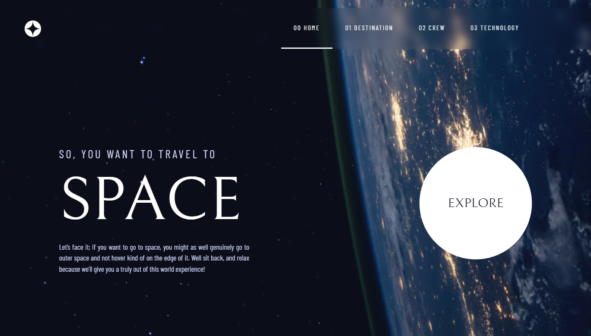

# Frontend Mentor - Space tourism website solution

This is a solution to the [Space tourism website challenge on Frontend Mentor](https://www.frontendmentor.io/challenges/space-tourism-multipage-website-gRWj1URZ3).

## Table of contents

- [Overview](#overview)
  - [The challenge](#the-challenge)
  - [Screenshot](#screenshot)
  - [Links](#links)
- [My process](#my-process)
  - [Built with](#built-with)
  - [What I learned](#what-i-learned)
  - [Continued development](#continued-development)
  - [Useful resources](#useful-resources)
- [Author](#author)
- [Acknowledgments](#acknowledgments)

## Overview

### The challenge

Users should be able to:

- View the optimal layout for each of the website's pages depending on their device's screen size
- See hover states for all interactive elements on the page
- View each page and be able to toggle between the tabs to see new information

### Screenshot



### Links

- Solution URL: [Click here](https://www.frontendmentor.io/solutions/space-tourism-multipage-website-1DWxFcFiU)
- Live Site URL: [Click here](https://space-tourism-multi-page-website-one.vercel.app/)

## My process

### Built with

- Semantic HTML5 markup
- CSS custom properties
- Bootstrap grid
- JavaScript

### What I learned

When developing this Space tourism multi page website project, these new things I have learned.

-How to read current browser window URL and using that output how to initiate things in script.

```js
if(window.location.href.indexOf("index") != -1){
    homeNavBtn.classList.add("nav-btn-active");
}
else if(window.location.href.indexOf("destination") != -1){
    destNavBtn.classList.add("nav-btn-active");
    homeNavBtn.classList.remove("nav-btn-active");
}
else if(window.location.href.indexOf("crew") != -1){
    crewNavBtn.classList.add("nav-btn-active");
    homeNavBtn.classList.remove("nav-btn-active");
}
else if(window.location.href.indexOf("tech") != -1){
    techNavBtn.classList.add("nav-btn-active");
    homeNavBtn.classList.remove("nav-btn-active");
}
```
----

-How to work with responsive breakpoints using JavaScript script.

```js
techBtn1.addEventListener('click', changeImg1);
function changeImg1(){
    if (sWidth >= 1280){
        tecImage.style.backgroundImage = "url(/assets/technology/image-launch-vehicle-portrait.jpg)";
    }
    else if (sWidth >= 768){
        tecImage.style.backgroundImage = "url(/assets/technology/image-launch-vehicle-landscape.jpg)";
    }
    else if (sWidth >= 375){
        tecImage.style.backgroundImage = "url(/assets/technology/image-launch-vehicle-landscape.jpg)";
    }
}
```
----

-Most importantly, I learned using **onload** is a bad practise. Instead of using **onload** event, it is better to use **load** with **addEventListner**.

```js
window.addEventListener('load',crewFunc);
```

### Continued development

There are some multiple issues that I have faced constantly during this project. Those are,

-The browser console showing me some errors as below.

***Uncaught TypeError: Cannot read properties of null (reading 'classList')***

----
***Uncaught TypeError: Cannot set properties of null (setting 'onclick')***

Nevertheless, there are no any not working sections in the live site. So, I couldn't manage to find a way to resolve these issues. I am intend to find the solutions for these issues in the future projects.

### Useful resources

- [Stackoverflow](https://stackoverflow.com/) - This helped me for many issues I have faced during the development of the project.
- [W3Schools](https://www.w3schools.com/) - Same as **Stackoverflow** , this helped me to understand some fundamental things about CSS and JS.

## Author

- Website - [SLGPLAY](https://www.slgplay.net)
- Frontend Mentor - [@T-Induwara](https://www.frontendmentor.io/profile/T-Induwara)
- Github - [@T-Induwara](https://github.com/T-Induwara)
- LinkedIn - [@t-induwara](https://www.linkedin.com/in/t-induwara/)

## Acknowledgments

I want to give thanks specially to [Web Dev Simplified](https://youtu.be/At4B7A4GOPg) YouTube channel for helping me to get some inspiration to develop the navbar of this project.
